# Awesome-Fine-Grained-Authorization-Permissions-Management

# Awesome-Fine-Grained-Authorization-Permissions-Management 🔐 🛡️

  

  

  

  

  

  

  

---

## 🌟 Top Fine-Grained Authorization & Permissions Management Ecosystem

**Curated List of Commercial Authorization Platforms & Open-Source Policy Engines**  

*Focused on ReBAC, ABAC, Policy-as-Code, Zanzibar-Inspired Authorization, PDP/PEP Architecture & Self-Hosted Decision Engines*

**Last updated: October 2026** 📅

---

### 📌 Overview & SEO Summary

Welcome to the ultimate curated directory of **fine-grained authorization platforms**, **open-source policy engines**, and **relationship-based access control (ReBAC) systems**. Whether you are looking for enterprise-grade commercial solutions (such as *Auth0 FGA*, *Permit.io*, and *Styra DAS*), or self-hostable open-source alternatives (like *SpiceDB*, *OpenFGA*, and *Cerbos*), this list covers category leaders, Zanzibar-inspired models, and privacy-respecting authorization infrastructure.

**Key Market Context:**

- **Google Zanzibar paper (2019)** inspired a generation of ReBAC systems — **SpiceDB and OpenFGA** are the **two dominant open-source implementations**, both targeting **p99 < 10ms** for authorization checks .

- **Cerbos** is the **developer-loved stateless PDP**, with **YAML policies**, **GitOps-native workflows**, and **sub-millisecond checks** — but **no native ListObjects capability** .

- **Topaz (Aserto)** provides a **hybrid model** — **Zanzibar relationship directory + OPA Rego policy engine** — for teams needing both relationship graphs and complex policy logic .

---

## 📑 Table of Contents

- [🏢 SaaS & Commercial Platforms](#-saas--commercial-platforms)

- [🔓 Open-Source GitHub Projects](#-open-source-github-projects)

- [🛠️ How to Contribute](#%EF%B8%8F-how-to-contribute)

- [📊 Star History](#-star-history)

- [🤝 Support & Sponsorship](#-support--sponsorship)

- [⚠️ Disclaimer](#%EF%B8%8F-disclaimer)

---

## 🏢 SaaS / Commercial Platforms

The fine-grained authorization market spans **managed ReBAC platforms** (Auth0 FGA, Permit.io) that provide **Zanzibar-style authorization as a service**, **policy-as-code platforms** (Styra DAS, Oso Cloud) that focus on **OPA-based policy management**, and **enterprise authorization orchestration** (PlainID) that offers **PBAC for estate-wide governance**. **Auth0 FGA** offers a **free tier with usage-based pricing** . **Permit.io** provides a **full-stack authorization platform** with a **free tier** . **Styra DAS** uses **custom enterprise pricing** . **Oso Cloud** offers **OSS + managed** options .

| SaaS / Commercial Platform | Company / Owner | Valuation / Market Cap | Standard Edition Starting Price | Free Tier / Free Trial Limits | Description |

| :--- | :--- | :--- | :--- | :--- | :--- |

| **[Auth0 FGA](https://auth0.com/fine-grained-authorization)** 🔷 | Okta (Acquired Auth0) | ~$15 Billion (Okta) | **Free tier**; **usage-based pricing**  | **Free tier available**  | **Managed Zanzibar-style ReBAC** — **Built on OpenFGA OSS core** for reduced vendor lock-in . **Seamless CIAM integration** with Okta Identity Cloud. **Best for product-scale sharing and hierarchical authorization** . |

| **[Permit.io](https://www.permit.io/)** 🟢 | Permit.io | Private | **Free tier**; **custom enterprise pricing**  | **Free tier available**  | **Full-stack authorization platform** — **RBAC, ABAC, and ReBAC** support . **Policy-as-code** with **OPA and Cedar** backends. **No-code policy editor** for non-developers. **The most complete managed authorization platform** . |

| **[Styra DAS](https://www.styra.com/)** 🟡 | Styra | Private | **Custom enterprise pricing**  | **No free tier**; demo available | **Enterprise OPA management** — **Declarative Authorization Service** for OPA at scale. **Policy lifecycle management, compliance, and audit**. **Note: Verify current vendor status** before committing . |

| **[Oso Cloud](https://www.osohq.com/)** 🟣 | Oso | Private | **OSS + Managed**  | **Free tier available** | **Embedded authorization library** — **Polar language** for policy definition. **SDKs for Python, Node, Go, Ruby, Java, and Rust**. **The most developer-friendly embedded authorization** . |

| **[PlainID](https://www.plainid.com/)** 🔴 | PlainID | Private | **Custom enterprise pricing**  | **Demo available** | **Enterprise PBAC orchestration** — **Policy-based access control** for IT estate governance . **Centralized authorization orchestration** across applications and APIs. **Best for large enterprise governance** . |

| **[Aserto](https://www.aserto.com/)** 🔵 | Aserto | Private | **OSS (Topaz) + Managed**  | **OSS free forever** | **Hybrid ReBAC + OPA** — **Topaz open-source core** with **managed SaaS options** . **Relationship directory + Rego policy engine**. **Verify vendor stability** before long-term commitment . |

---

## 🔓 Open-Source GitHub Projects

*Sorted by GitHub_Stars_Count (Descending)* 🌟

- **[SpiceDB](https://github.com/authzed/spicedb)**   

  **Open source, Google Zanzibar-inspired permissions database**, Apache-2.0 licensed. **4,131 GitHub stars**  — **the leading open-source ReBAC implementation** . **Scalably store and query fine-grained authorization data** . **Rich SDK ecosystem**: Go, Node, Python, Java, Ruby . **LookupResources API** for "what can this user access" queries . **Caveats** for ABAC-style conditional permissions . **p99 < 10ms** check latency target . **The most mature open-source Zanzibar implementation** . 🛡️

- **[OpenFGA](https://github.com/openfga/openfga)**   

  **High performance and flexible authorization/permission engine**, Apache-2.0 licensed. **4,763 GitHub stars**  — **CNCF Sandbox project** (graduation track 2024) . **Auth0/Okta open-sourced** in 2022 . **JSON-based model definition** with rich SDKs (Node, Go, Python, Java, .NET, Ruby) . **ListObjects API** for reverse queries . **Conditions** for contextual ABAC . **The most widely adopted open-source ReBAC engine** — powers Auth0 FGA . 🎯

- **[Permify](https://github.com/Permify/permify)**   

  **Open-source authorization as a service**, Apache-2.0 licensed. **5,612 GitHub stars**  — **inspired by Google Zanzibar** . **Build and manage fine-grained and scalable authorization systems** for any application . **Permify CLI** for schema management . **Part of FusionAuth ecosystem** (as of 2026). **The most accessible open-source authorization service** . 📦

- **[Cerbos](https://github.com/cerbos/cerbos)**   

  **Open core, language-agnostic, scalable authorization solution**, Apache-2.0 licensed. **4,217 GitHub stars**  — **the developer-loved stateless PDP** . **YAML policies with GitOps-native workflow** . **Sub-millisecond checks** with **no relationship graph storage** . **Weakness: no native ListObjects** — graph queries require pattern workarounds . **Cerbos Hub** for managed policy distribution . **The best self-hosted PDP for teams wanting decoupled authorization in their own infrastructure** . ⚡

- **[Topaz (Aserto)](https://github.com/aserto-dev/topaz)**   

  **Cloud-native authorization for modern applications and APIs**, Apache-2.0 licensed. **1,323 GitHub stars**  — **the OSS hybrid model** . **Combines Zanzibar relationship directory with OPA Rego policy engine** . **Sidecar deployment** for microservices architectures . **"Use Zanzibar for the relationship graph, Rego for the policy decision"** — explicitly hybrid . **The credible OSS middle path for teams wanting relationship data and policy logic in one self-hosted authorizer** . **Note: Verify vendor stability before long-term commitment** . 🔗

- **[Ory Keto](https://github.com/ory/keto)**   

  **Open-source authorization service**, Apache-2.0 licensed. **The authorization component of the Ory ecosystem** (Hydra OAuth2, Kratos Identity) . **Rewritten on Zanzibar model in 2021** . **ACL model with fine-grained permissions** . **The most integrated open-source authorization for Ory users** . 🐉

- **[Warrant](https://github.com/warrant-dev/warrant)**   

  **Highly scalable, centralized authorization service**, Apache-2.0 licensed. **937 GitHub stars**  — **faithful Zanzibar implementation** . **Acquired by Okta in 2023** and **unified with OpenFGA** . **Define, enforce, query, and audit application authorization** . **The most mature Zanzibar implementation** (pre-acquisition). 🏛️

- **[Casbin](https://github.com/casbin/casbin)**   

  **Authorization library with support for ACL, RBAC, ABAC**, Apache-2.0 licensed. **The most widely deployed embedded authorization library** . **Model-based** — no separate server needed. **Supports Go, Java, Node.js, Python, PHP, and more**. **The simplest entry point to open-source authorization** . 🔧

- **[CASL](https://github.com/stalniy/casl)**   

  **Isomorphic authorization JavaScript library**, MIT licensed. **Restricts what resources a user is allowed to access** . **Works on client and server**. **The most popular JavaScript authorization library** . 🟨

- **[Permify CLI](https://github.com/Permify/permify-cli)**   

  **Command line interface for Permify**, Apache-2.0 licensed. **Manage Permify authorization schemas and data from the terminal** . **The official CLI for Permify** . 🖥️

- **[SpiceDB Operator](https://github.com/authzed/spicedb-operator)**   

  **Kubernetes controller for managing SpiceDB instances**, Apache-2.0 licensed. **48 GitHub stars** . **The standard way to deploy SpiceDB on Kubernetes** . ☸️

- **[keycloak-openfga-event-publisher](https://github.com/embesozzi/keycloak-openfga-event-publisher)**   

  **Keycloak OpenFGA Event Publisher**, Apache-2.0 licensed. **35 GitHub stars** . **Event integration between Keycloak and OpenFGA** for fine-grained authorization at scale . **The bridge between identity and authorization** . 🔗

---

## 🛠️ How to Contribute

Contributions are welcome! Follow these steps to submit new authorization platforms or open-source policy engines:

1. 🍴 **Fork** the repository.

2. 📝 **Add/edit** entries in `README.md` maintaining table/list structure and formatting.

3. 🔗 Include project title, official website/GitHub link, exact Stars_Count, license, and brief description.

4. 🚀 Submit a **Pull Request** with a descriptive summary of your changes.

---

## 📊 Star History

---

## 🤝 Support & Sponsorship

If you find this fine-grained authorization repository useful, please consider supporting the project:

- ⭐ **Star** this repository to increase visibility!

- 🔀 **Fork** and share with fellow security engineers, platform teams, and open-source advocates.

- ☕ **Sponsor & Buy Me a Coffee**: Support ongoing open-source curation via the [GitHub Sponsor Dashboard](https://github.com/sponsors/ishandutta2007).

---

## ⚠️ Disclaimer

- This is a **community-curated** list — not exhaustive and not an endorsement. ℹ️

- **Zanzibar-style (ReBAC) vs. Policy-as-Code (ABAC) is the fundamental architectural choice** — **SpiceDB and OpenFGA** are the **two dominant open-source ReBAC implementations** . **Cerbos and OPA** are **stateless policy engines** — **fast for Check but cannot do ListObjects** . **Topaz/Aserto provides the hybrid** .

- **Cerbos is the developer-loved stateless PDP** with **sub-millisecond checks** and **GitOps-native YAML policies** — but **no native ListObjects** . **SpiceDB and OpenFGA target p99 < 10ms** for Check operations .

- **Open-source authorization engines are not turnkey** — they require **deployment, schema design, data synchronization, and ongoing maintenance** . **SpiceDB requires a datastore (PostgreSQL, CockroachDB, or memory)** . **OpenFGA requires a database (PostgreSQL or MySQL)** . **Always validate authorization correctness and performance with a proof-of-concept** before production deployment . 🔐

---

  <b>Made with ❤️ for security engineers, platform teams, and open-source authorization advocates.</b>

